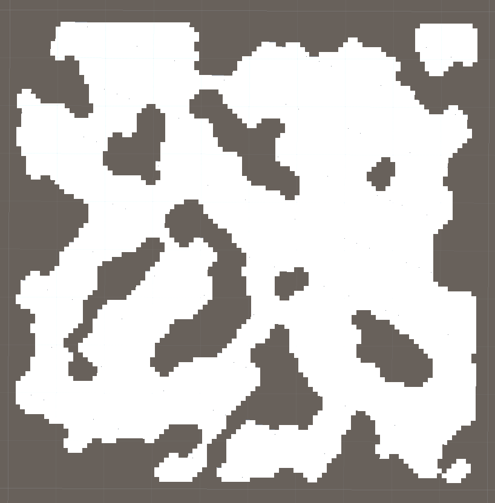

# DungeonCreator

My goal with this project is to get a better understanding on dungeon creation algorithms.  
I will mostly be trying out different approaches on how to generate dungeons with different algorithms and how to layer and combine algorithms for better effects.

## Current Algorithms
 -	Binary Space Partitioning (used for room-based dungeons for now)
 -	Height Map combined with Cellular Automata (experimenting with caves)

## Demonstrations

Binary Space Partitioning (Rooms)  

 

Height Map (Perlin Noise) + Cellular Automata (Caves)  

## Planned
 - 	implement functionality to connect isolated caves
 -	use BSP for generating caves

## Additional Notes

Unity Version used: 2020.3.0f1

Resources used:
 -	Basic BSP Dungeon Generation  
	http://www.roguebasin.com/index.php?title=Basic_BSP_Dungeon_generation
 -	Improved Noise reference implementation (by Ken Perlin)  
	https://mrl.cs.nyu.edu/~perlin/noise/
 - 	"Procedural Landmass Generation" by Sebastian Lague  
	used to better understanding how to work with Perlin Noise

