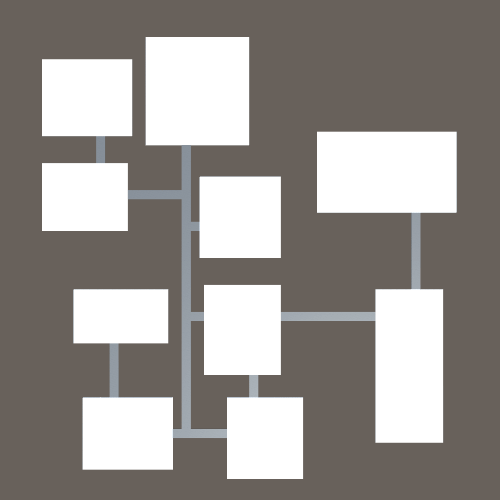

# DungeonCreator

My goal with this project is to get a better understanding on dungeon creation algorithms.  

## Current Algorithms
 - Binary Space Partitioning Algorithm
 
## Planned Algorithms
 - Cellular Automata
 - Height Map

## Demonstrations

## Additional Notes

Unity Version used: 2020.3.0f1

Resources used:
 -	Basic BSP Dungeon Generation
	http://www.roguebasin.com/index.php?title=Basic_BSP_Dungeon_generation

