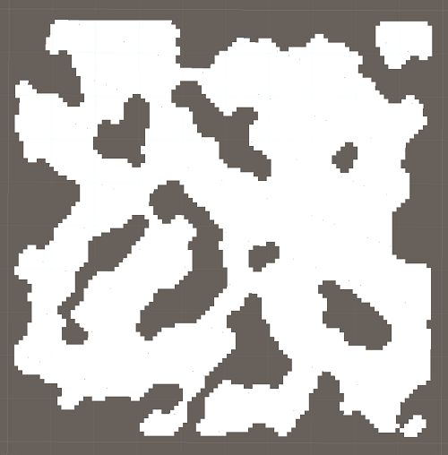

# DungeonCreator

`work in progress`

My goal with this project is to get a better understanding of procedural dungeon 
generation algorithms and to provide a collection of algorithms inside a dll for future projects.

## Current Algorithms
 -	Binary Space Partitioning (room based dungeons)
 -	Height Map + Cellular Automata (cave-like dungeons)

## Demonstrations
Created with a basic Unity Project.

Binary Space Partitioning (Rooms)  

 
Height Map (Perlin Noise) + Cellular Automata  

## Resources used

 -	Basic BSP Dungeon Generation  
	http://www.roguebasin.com/index.php?title=Basic_BSP_Dungeon_generation
 -	Improved Noise reference implementation (by Ken Perlin)  
	https://mrl.cs.nyu.edu/~perlin/noise/
 - 	"Procedural Landmass Generation" by Sebastian Lague  
	https://www.youtube.com/playlist?list=PLFt_AvWsXl0eBW2EiBtl_sxmDtSgZBxB3  
	used to better understanding how to work with Perlin Noise

